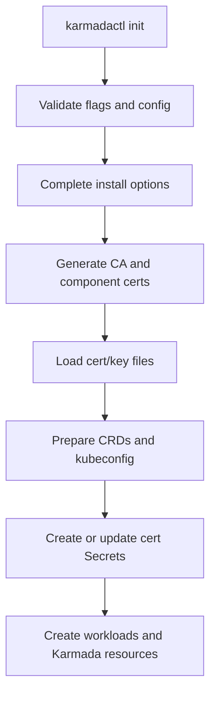
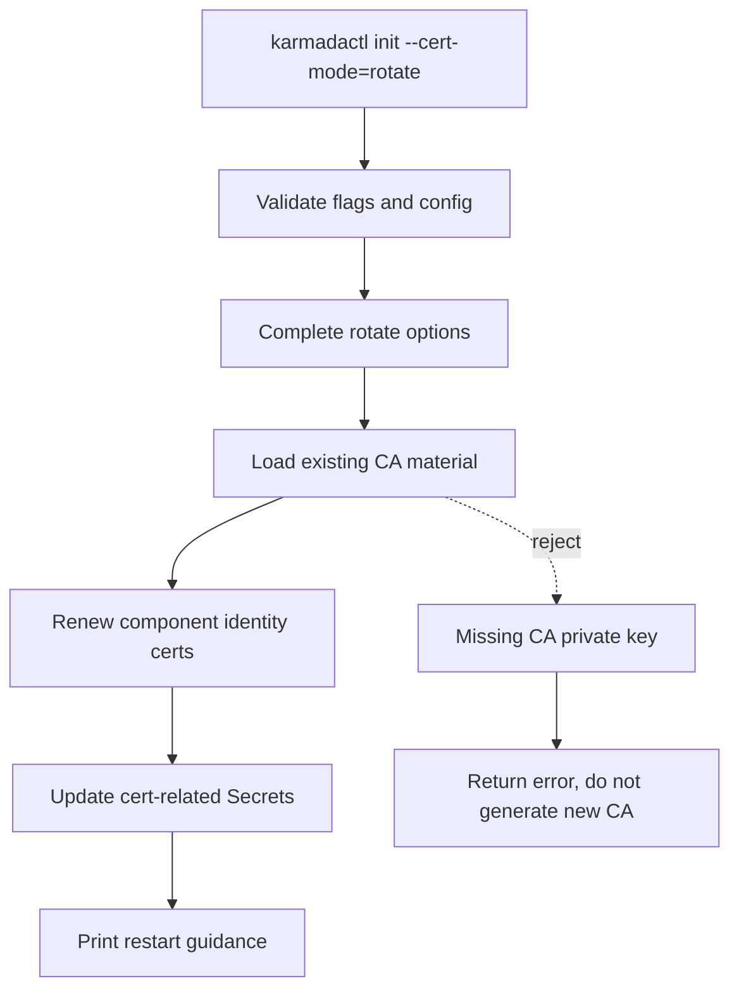
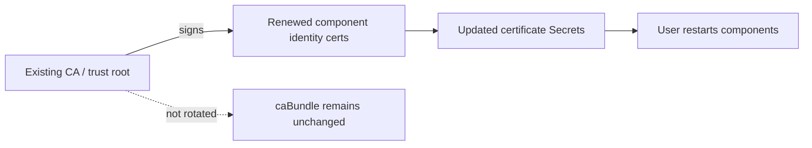

# Day 7: `karmadactl init` 证书轮换社区会议提案

日期：2026-07-01

## 会议目标

这份文档用于准备社区会议上的提案说明。目标不是先提交最终代码，而是让维护者对第一版实现边界达成共识：

> 为 `karmadactl init` 增加一个证书轮换模式，例如 `--cert-mode=rotate`，用于重新签发 Karmada 控制面组件身份证书并更新相关 Secrets。第一版只轮转组件身份证书，不轮转 CA/root certificates，不更新 caBundle，不重建 workload。

会议上希望拿到的结论：

1. 是否认可第一版只做 `karmadactl init`。
2. 是否认可只轮转组件身份证书，CA/root certificates 不轮转。
3. 是否认可 `--cert-mode=rotate` 作为 CLI 入口。
4. 既有 CA private key 从哪里读取：用户传文件，还是从现有 Secret 读取。
5. 是否只更新 Secrets 并提示用户重启组件。
6. PR 是否按“重构证书材料准备 -> rotate mode -> 文档”拆分。

## One-Pager

### Problem

Karmada 控制面有多类证书和 Secrets。证书过期后，用户手工轮换需要知道每个证书如何生成、放在哪个 Secret、挂载到哪个组件、哪些 kubeconfig 需要更新、哪些组件需要重启。这个过程复杂且容易漏步骤。

社区已有背景：

- [karmada#4787](https://github.com/karmada-io/karmada/issues/4787)：生产环境里证书过期会导致组件 CrashLoop，用户希望有类似 `kubeadm certs renew all` 的工具。
- [website#1014](https://github.com/karmada-io/website/issues/1014)：正在跟踪证书轮换指南，说明证书轮换是文档和工具都需要补齐的问题。
- [karmada#5037](https://github.com/karmada-io/karmada/pull/5037)：曾尝试 cert-manager/trust-manager 自动轮换，但 PR 范围过大，包含 Helm、HPA、ServiceMonitor 等多个主题，不适合作为第一步。
- [karmada#7693](https://github.com/karmada-io/karmada/issues/7693)：维护者提出先复用安装工具已有证书生成和 Secret 挂载能力，把它包装成证书轮换能力，第一步聚焦 `karmadactl init`。

### Proposal

新增 `karmadactl init` 证书模式：

```bash
karmadactl init --cert-mode=rotate <other flags consistent with the original installation>
```

`rotate` 模式做：

1. 解析与原安装一致的 flags / config。
2. 读取既有 CA 材料。
3. 使用既有 CA 重新签发组件身份证书。
4. 更新 `karmadactl init` 管理的证书相关 Secrets。
5. 输出需要重启的组件提示。

`rotate` 模式不做：

- 不轮转 CA/root certificates。
- 不更新 caBundle、APIService、WebhookConfiguration、CRD conversion caBundle。
- 不重新创建 Deployment、StatefulSet、Service、CRD。
- 不做 Helm/operator/cert-manager integration。
- 不自动 rollout restart。
- 不做 Secret layout redesign。

### Why This Scope

第一版选择小范围，是为了避免把“证书续期”变成“信任根迁移”。

组件身份证书是被轮转对象，例如 apiserver server cert、kubeconfig client cert、front-proxy-client cert、internal etcd server/client cert。CA/root certificates 是信任链基石。如果 CA 变化，所有依赖该 CA 的 kubeconfig、WebhookConfiguration、APIService、CRD conversion caBundle 和组件间 TLS 信任链都可能要同步更新，风险和实现面都明显扩大。

所以第一版只做：

```text
existing CA -> renew component identity certs -> update cert Secrets -> user restarts components
```

## Meeting Talk Track

### 30-Second Version

```text
I would like to propose a small first step for Karmada certificate rotation.

Instead of introducing cert-manager integration or changing the Secret layout in the first PR, I suggest we add a rotate mode to `karmadactl init`.

The rotate mode reuses the existing CA, renews Karmada component identity certificates, updates the certificate-related Secrets, and then asks users to restart the related components.

It does not rotate root CAs, does not update caBundle, and does not recreate workloads. This keeps the first version focused and avoids turning certificate renewal into trust-root migration.
```

### 3-Minute Version

```text
The problem I want to solve is the manual rotation of Karmada control-plane certificates installed by `karmadactl init`.

Today users need to understand which certificates exist, which Secrets store them, which kubeconfigs embed them, and which components consume them. From #4787, this is a real operational problem: when certificates expire, several Karmada components may crash and recovery is hard to execute reliably.

There was also a larger attempt in #5037 around cert-manager and trust-manager integration, but that PR mixed many topics and became too large. For the first step, I think we should follow #7693 and reuse what the installation tool already knows.

My proposal is to add a certificate mode to `karmadactl init`, for example:

`karmadactl init --cert-mode=rotate <same installation flags>`

In rotate mode, the command will not perform a normal installation. It will load the existing CA material, renew the component identity certificates, and update the certificate-related Secrets. After that, users restart the related Karmada components so that the Pods reload the updated Secret content.

The important boundary is that this first version does not rotate root CAs. CAs are trust anchors. Rotating them would require updating kubeconfigs, webhook caBundles, APIService CABundles, and CRD conversion caBundles, and that becomes a trust-root migration problem. So the first version only renews leaf or component identity certificates.

The implementation can be small:

1. Add a cert mode option.
2. Split the current install flow so that certificate material preparation and Secret synchronization can be reused.
3. Add a rotate path that updates Secrets only.
4. Add fake-client tests proving that rotate mode updates Secrets but does not create workloads or update caBundle.
5. Follow up with website documentation under website#1014.

The main questions I want feedback on are:

1. Is `--cert-mode=rotate` the right UX?
2. Should rotate mode require CA files from the user, or can it read the existing CA key from the current Secrets?
3. Should the command only print restart guidance, or should it support automatic restart later?
```

## Scope Definition

### Goals

| Goal | Description |
| --- | --- |
| Support `karmadactl init` rotation mode | Add a mode like `--cert-mode=rotate` to reuse the init tool's certificate knowledge. |
| Renew component identity certificates | Re-sign server/client leaf certs using existing CA material. |
| Update certificate-related Secrets | Reuse or extract current Secret creation/update logic. |
| Preserve existing trust roots | Do not rotate CA/root certificates in the first version. |
| Avoid reinstall side effects | Do not create or update workloads, CRDs, Services, Node labels, or install-only resources. |
| Provide restart guidance | Print the components that should be restarted after Secrets are updated. |
| Add tests | Use fake client tests to prove rotate mode touches only the expected resources. |

### Non-Goals

| Non-goal | Reason |
| --- | --- |
| Root CA rotation | This is trust-root migration and needs separate design. |
| caBundle update | CA does not change, so caBundle should remain unchanged. |
| cert-manager integration | Useful follow-up, but too large for the first PR. |
| Helm/operator support | #7693 explicitly suggests first focusing on `karmadactl init`. |
| Secret layout redesign | Not needed to provide a working rotation path. |
| Automatic hot reload | Current components generally need restart to reload mounted Secret data. |
| Automatic rollout restart | Can be discussed later; first version can print restart commands. |

## Terminology

| Term | Meaning | First-version behavior |
| --- | --- | --- |
| Component identity certificate | TLS server/client certificate used by a component to prove its identity. Also called leaf certificate. | Renewed. |
| CA / root certificate | Certificate authority used to sign component certificates. Trust anchor. | Not rotated. |
| caBundle | Trust bundle embedded in webhook/APIService/CRD conversion configs. | Not updated. |
| Certificate Secret | Kubernetes Secret holding cert/key data and kubeconfig content. | Updated. |

## Current Flow vs Proposed Flow

### Current Install Flow



### Proposed Rotate Flow



### Trust Boundary



## Proposed User Experience

### Normal Install

```bash
karmadactl init \
  --namespace karmada-system \
  --cert-external-ip 10.0.0.10 \
  --cert-external-dns karmada.example.com
```

### Rotate

```bash
karmadactl init --cert-mode=rotate \
  --namespace karmada-system \
  --cert-external-ip 10.0.0.10 \
  --cert-external-dns karmada.example.com \
  --cert-validity-period 8760h
```

The command should finish with guidance similar to:

```text
Certificate Secrets have been updated.

Please restart the related Karmada components to load the new certificates:
  kubectl -n karmada-system rollout restart deploy/karmada-apiserver
  kubectl -n karmada-system rollout restart deploy/karmada-aggregated-apiserver
  kubectl -n karmada-system rollout restart deploy/karmada-controller-manager
  kubectl -n karmada-system rollout restart deploy/karmada-kube-controller-manager
  kubectl -n karmada-system rollout restart deploy/karmada-scheduler
  kubectl -n karmada-system rollout restart deploy/karmada-webhook

If internal etcd certificates were renewed, restart the etcd StatefulSet according to your maintenance window.
```

## Implementation Design

### New Option

Add cert mode to `CommandInitOption`:

```go
const (
    CertModeInstall = "install"
    CertModeRotate  = "rotate"
)

type CommandInitOption struct {
    CertMode string
}
```

Add flag:

```go
flags.StringVar(&opts.CertMode, "cert-mode", CertModeInstall, "The certificate handling mode. Supported values: install, rotate.")
```

If config file parity is desired:

```yaml
spec:
  certMode: rotate
```

### Complete Split

Current `Complete()` includes install-only behavior:

- NodePort existence check.
- Node label mutation/check for hostPath etcd.
- install command args generation.
- data path initialization that can clean directories.

Proposed split:

```text
Complete()
  -> completeCommon()
  -> switch CertMode:
       install: completeInstall()
       rotate: completeRotate()
```

`completeRotate()` should:

- initialize Kubernetes client;
- validate target namespace exists;
- avoid NodePort conflict checks;
- avoid Node label mutation;
- avoid install data path cleanup;
- prepare a temporary cert output path if local files are needed.

### Certificate Material Preparation

Current `cert.GenCerts()` cannot be reused directly for rotate mode because it can generate new CAs.

Install path can keep current behavior:

```text
prepareInstallCertMaterial()
  -> genCerts()
  -> load generated cert/key data
```

Rotate path should be separate:

```text
prepareRotateCertMaterial()
  -> loadExistingCAMaterial()
  -> renewComponentIdentityCerts()
  -> load renewed cert/key data into CertAndKeyFileData
```

CA material source options:

| Option | Behavior | Tradeoff |
| --- | --- | --- |
| Require CA files | User passes `--ca-cert-file` / `--ca-key-file` and equivalent front-proxy/etcd CA inputs if needed. | Explicit and safer, but more flags may be needed. |
| Read CA from existing Secrets | Command reads current `karmada-cert` / `etcd-cert` CA cert/key data. | Easier UX and matches current Secret layout, but uses sensitive CA key stored in cluster Secrets. |
| Hybrid | Prefer explicit files when provided; otherwise read existing Secrets. | Best UX, but must be documented carefully. |

Meeting recommendation:

> Use the hybrid model if maintainers are comfortable reading existing CA keys from current Secrets. Otherwise start with explicit CA file inputs and improve UX later.

### Secret Synchronization

Current `createCertsSecrets()` already uses `util.CreateOrUpdateSecret()`. It can be reused or renamed internally:

```text
syncCertSecrets()
  -> component kubeconfig Secrets
  -> karmada-cert
  -> etcd-cert
  -> karmada-webhook-cert
```

Rotate mode should update only cert-related Secrets. It should not create or update workloads.

### External Etcd

For external etcd:

- Do not generate external etcd CA.
- Do not rotate external etcd server certificate.
- If the user provides external etcd client cert/key paths, sync those into the relevant Secret.
- If not provided, either preserve existing external etcd data from current Secret or return a clear error. This needs maintainer input.

### Restart Behavior

First version should print guidance, not restart automatically.

Reason:

- Restarting components can disrupt control plane availability.
- Internal etcd restart order may need operator judgment.
- Automatic restart can be a later flag, for example `--restart-components`.

## Resource Touch Matrix

| Resource type | Install mode | Rotate mode |
| --- | --- | --- |
| Namespace | create/update | require existing or optionally verify only |
| Secret | create/update | update cert-related Secrets |
| Deployment | create/update | no change |
| StatefulSet | create/update | no change |
| Service | create/update | no change |
| CRD | create/patch | no change |
| WebhookConfiguration | create/update | no change |
| APIService | create/update | no change |
| caBundle | set from CA | no change |
| Node label | may mutate | no change |
| Local data path | may initialize | avoid destructive cleanup |

## Test Plan

### Unit / Fake Client Tests

| Test | Expected result |
| --- | --- |
| default mode validation | `install` is accepted and existing behavior remains unchanged |
| rotate mode validation | `rotate` is accepted |
| invalid mode | returns validation error |
| rotate missing namespace | clear error |
| rotate missing CA key | clear error, no new CA generated |
| rotate updates Secrets | expected Secrets are updated |
| rotate does not create workloads | no Deployment/StatefulSet/Service create actions |
| rotate does not update trust bundles | no WebhookConfiguration/APIService/CRD caBundle update actions |
| external etcd handling | external certs are preserved or synced according to chosen policy |

### Local Verification Commands

```bash
go test ./pkg/karmadactl/cmdinit/... -count=1
hack/verify-command-line-flags.sh
git diff --check
```

For exported symbols / new package-level API:

```bash
PATH="$(go env GOPATH)/bin:$PATH" golangci-lint run ./pkg/karmadactl/cmdinit/...
hack/verify-staticcheck.sh
hack/verify-import-aliases.sh
```

### Smoke Test

```bash
karmadactl init ...
kubectl -n karmada-system get secret karmada-cert etcd-cert karmada-webhook-cert

karmadactl init --cert-mode=rotate <same cert flags>
kubectl -n karmada-system get secret karmada-cert -o yaml

kubectl -n karmada-system rollout restart deploy/karmada-apiserver
kubectl -n karmada-system rollout restart deploy/karmada-aggregated-apiserver
kubectl -n karmada-system rollout restart deploy/karmada-controller-manager
kubectl -n karmada-system rollout restart deploy/karmada-kube-controller-manager
kubectl -n karmada-system rollout restart deploy/karmada-scheduler
kubectl -n karmada-system rollout restart deploy/karmada-webhook

kubectl -n karmada-system get pods
```

## PR Plan

### PR 1: Refactor Certificate Preparation Boundary

Goal:

- Keep install behavior unchanged.
- Extract reusable cert material loading / Secret sync boundary.

Validation:

- Existing tests pass.
- Add tests proving default install path is unchanged where practical.

### PR 2: Add Rotate Mode

Goal:

- Add `--cert-mode=rotate`.
- Renew component identity certs with existing CA.
- Update cert-related Secrets only.

Validation:

- Fake client tests for resource touch matrix.
- command-line flags generated.
- targeted `go test`.

### PR 3: Documentation

Goal:

- Add website manual rotation guide under [website#1014](https://github.com/karmada-io/website/issues/1014).
- Explain CA is not rotated in this feature.
- Explain required original flags and restart steps.

## Open Questions For Maintainers

1. Is `--cert-mode=rotate` the right CLI shape, or should it be a dedicated subcommand?
2. Should default mode be explicit `install`, or should empty value mean install?
3. Should rotate read CA private keys from existing Secrets, require explicit CA files, or support a hybrid model?
4. Should rotate require all target Secrets to already exist?
5. Should local kubeconfig files be regenerated, or only in-cluster kubeconfig Secrets?
6. For external etcd, should missing external cert paths preserve existing Secret data or fail fast?
7. Should restart guidance be plain text only, or should we add an optional automatic restart flag later?

## Suggested Meeting Ask

The proposed ask in the meeting:

```text
I would like to confirm whether this first-version scope is acceptable:

1. Focus only on `karmadactl init`.
2. Add `--cert-mode=rotate`.
3. Renew component identity certificates only.
4. Reuse existing CA material and do not rotate root CAs.
5. Update certificate-related Secrets only.
6. Do not update caBundle or recreate workloads.
7. Print restart guidance and leave automatic restart for a follow-up.

If this scope looks reasonable, I can start with a small PR that separates the certificate material preparation and Secret synchronization boundaries, then add the rotate path in a follow-up PR.
```

## Notes For Myself

- Do not present this as “complete certificate management”. It is a practical first step for the `karmadactl init` installation path.
- Do not mention split Secret layout as the main proposal. It is background only.
- Keep the root CA decision clear: CA/root certificates are not rotated in this feature.
- The most sensitive design question is whether reading CA keys from existing Secrets is acceptable.
- The most important implementation risk is accidentally reusing install-only `Complete()` behavior in rotate mode.
