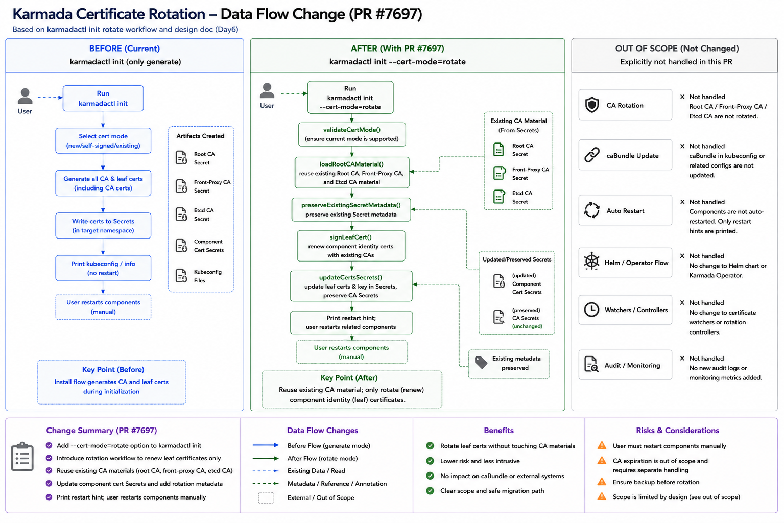

# Day 8: PR #7697 后续说明图和 follow-up PR 拆分回复

日期：2026-07-01

## 目标

PR [#7697](https://github.com/karmada-io/karmada/pull/7697) 已经进入 review 阶段。为了让 reviewer 更快理解这次变更，需要准备一条英文 PR comment，配合数据流变化图说明：

- 这个 PR 解决什么问题。
- `karmadactl init --cert-mode=rotate` 和原 install flow 的关系。
- 哪些证书会被轮换，哪些不会。
- 这个 PR 的 scope / non-goals。
- #7697 之后应该如何拆 follow-up PR，而不是继续把所有证书管理能力塞进同一个 PR。

这篇 Day 8 只准备草稿，不直接发布 upstream comment。发布前需要用户确认完整英文文本。

## 图片资产

当前准备了两张图：

1. 英文主图：`day8-karmada-certificate-rotation-data-flow-change.png`
2. 中文/中英混合辅助图：`day8-karmada-certificate-pr7697-change.png`

建议 PR comment 使用英文主图：



上传到 fork `intern` 分支后，可在 GitHub comment 中使用这个 raw URL：

```text
https://raw.githubusercontent.com/ranxi2001/karmada/intern/internship-reports/day8-karmada-certificate-rotation-data-flow-change.png
```

> 注释：图中底部 Change Summary 的 metadata 表达应按当前实现理解为 Secret update 时保留 existing metadata。当前 PR 不引入证书 rotation controller，也不新增自动 watcher / audit / monitoring 机制。

## 给自己看的中文理解

这条评论不是重新解释整个 PR，而是帮 reviewer 快速建立 mental model。

#7697 的核心变化可以概括为：

```text
原来：
karmadactl init 主要是安装路径，生成 CA + leaf certificates，然后创建 Secrets 和工作负载。

现在：
karmadactl init 增加 rotate mode。
rotate mode 不走安装资源创建，只读取现有 CA material，重新签发组件 leaf certificates，更新 init-managed certificate Secrets 和 kubeconfig Secrets，然后提示用户手动重启相关组件。
```

最重要的边界：

- CA/root CA 不轮换。
- caBundle 不更新。
- WebhookConfiguration / APIService / CRD conversion caBundle 不更新。
- Helm/operator 不处理。
- 不自动 rollout restart。
- 不引入 cert-manager。
- 不把 Secret layout redesign 混进来。

为什么要这么拆：

```text
leaf certificate renewal 是证书续期问题；
CA rotation 是 trust-root migration 问题。
```

如果把 CA rotation、caBundle、Helm/operator、自动重启、监控审计全放进 #7697，会让第一版 PR 失焦，也更难 review。#7697 应该先提供一个可工作的、低风险的 init-managed leaf certificate rotation path。

## 已发布的 PR Scope Comment

> 已由用户确认并发布到 PR #7697：
> <https://github.com/karmada-io/karmada/pull/7697#issuecomment-4851795706>
> 以下保留最终发布文本；图片使用 GitHub user attachment，避免依赖 fork 分支中的 raw 文件路径。

```md
I prepared a data-flow diagram to make the scope of this PR easier to review:


This PR adds a new certificate rotation path to `karmadactl init` through `--cert-mode=rotate`.

High-level behavior:

- The existing install/generate flow remains the default behavior.
- The new rotate flow reuses existing CA material from current init-managed Secrets.
- It renews component identity certificates, also known as leaf certificates.
- It updates init-managed certificate Secrets and kubeconfig Secrets.
- It preserves existing Secret metadata during updates.
- It prints restart guidance; components are not restarted automatically.

Intentional non-goals in this PR:

- No root CA / Front-Proxy CA / Etcd CA rotation.
- No caBundle updates in kubeconfigs, WebhookConfiguration, APIService, or CRD conversion configs.
- No workload recreation.
- No automatic rollout restart.
- No Helm or Karmada Operator flow changes.
- No cert-manager integration.
- No new certificate watcher/controller, audit log, or monitoring metric.

The main reason for this scope is to keep the first version focused on leaf certificate renewal. CA rotation is a trust-root migration problem and should be handled separately, because it would require updating all trust consumers consistently.

Suggested follow-up split after this PR:

1. Documentation PR: add a user-facing certificate rotation guide, including the required command, original install flags, backup recommendation, and manual restart steps. This can align with `karmada-io/website#1014`.
2. Restart UX follow-up: discuss whether Karmada should add an optional restart helper later. The current PR only prints restart guidance.
3. CA rotation design: if the community wants root CA rotation, handle it as a separate design/PR for trust-root migration, including caBundle and kubeconfig updates.
4. Helm/operator parity: if maintainers want rotation support outside `karmadactl init`, split Helm and operator support into separate PRs.
5. Observability follow-up: if needed, discuss audit logs or metrics separately from the core rotation flow.

For review, I think the most important parts are:

- Whether `--cert-mode=rotate` is an acceptable UX.
- Whether reading existing CA material from init-managed Secrets is acceptable for this first version.
- Whether the update-only Secret behavior is safe enough.
- Whether the current non-goals are aligned with maintainers' expectations.
```

## 后续 PR 拆分计划

| 顺序 | PR / 任务 | 范围 | 不包含 |
| --- | --- | --- | --- |
| 1 | #7697 当前 PR | `karmadactl init --cert-mode=rotate`，复用现有 CA，轮换 leaf certs，更新 init-managed Secrets | CA rotation、caBundle、Helm/operator、自动重启 |
| 2 | docs / website PR | 用户手册：备份、命令、参数、restart steps、风险说明 | 新代码 |
| 3 | restart UX follow-up | 可选讨论是否加自动 restart helper 或更明确 restart command 输出 | 默认自动重启 |
| 4 | CA rotation proposal | 单独设计 trust-root migration：CA 替换、caBundle、kubeconfig、组件重启顺序 | 不混入 leaf renewal PR |
| 5 | Helm/operator parity | 分别评估 Helm chart 和 Karmada Operator 是否需要类似 rotate 支持 | 不复用 `karmadactl init` PR 强行覆盖 |
| 6 | observability | 如果维护者需要，单独讨论 audit / metrics / event | 不阻塞第一版 rotate |

## 发布前检查

- [ ] 图片已经推到 `origin/intern`，raw URL 可访问。
- [ ] PR #7697 最新 CI 状态已确认。
- [ ] 英文 comment 已由用户确认。
- [ ] upstream comment 只发一次，避免刷屏。
- [ ] 如果 comment 中提到 follow-up PR，不承诺具体实现时间，只表达建议拆分方向。

## Mentor 追问后的本地多集群运行态观测

### 背景

mentor 提醒：之前新增的短有效期证书测试更偏向代码路径 / e2e 风格验证，只能说明 `karmadactl init` 可以生成短期证书并触发轮换逻辑，不能直接证明真实运行中的多集群控制面在证书过期后可以通过本 PR 恢复。

因此补做一次本地多集群观测实验，目标是验证完整运行态链路：

```text
短期证书安装 Karmada
  -> 等待证书真实过期
  -> 观察 Karmada API 和控制面组件异常
  -> 执行 --cert-mode=rotate 更新 Secret 中的 leaf certificates
  -> 手动重启相关组件加载新证书
  -> 观察 Karmada API、控制面组件和 member cluster 状态恢复
```

这次实验要注意表述边界：#7697 不是自动过期检测、自动轮换、自动重启方案。它验证的是用户发现证书过期或即将过期后，可以人工执行 rotate，然后人工重启组件使控制面恢复。

### 实验环境

| 项目 | 内容 |
| --- | --- |
| PR branch | `feature/cert-mode-rotate` |
| 本地 commit | `152ab4542` |
| 控制面安装方式 | 本地 PR 分支编译出的 `/root/go/bin/karmadactl` |
| 组件镜像 | `docker.io/karmada/*:v1.18.0` |
| kind 集群 | `cert-rotate-host`、`cert-rotate-member1`、`cert-rotate-member2`、`cert-rotate-member3` |
| 实际 join 的 member | `cert-rotate-member1`、`cert-rotate-member2`，Push mode |
| 初始证书有效期 | `--cert-validity-period=10m` |
| 轮换后证书有效期 | `--cert-validity-period=8760h` |
| etcd 存储 | `--etcd-storage-mode=hostPath` |
| 本地证据目录 | `/tmp/karmada-cert-rotate-observe/logs/` |

为什么改用 `hostPath` etcd：

之前用默认 `emptyDir` 做过一次验证，组件重启时 etcd 数据会随 pod 删除丢失，导致恢复结果被测试环境污染。为了验证“证书轮换后控制面恢复”，etcd 数据必须跨 pod 重启保留，所以这次改为 hostPath。

为什么使用 pod delete 而不是 `rollout restart`：

本地 kind 是单节点环境，Karmada init 创建的部分组件带有 pod anti-affinity。直接 `rollout restart` 会让新旧 pod 同时存在，新 pod 可能因为调度约束 Pending。为了观察证书加载效果，这次直接删除旧 pod，让 Deployment / StatefulSet 重新拉起组件。

### 关键命令

初始安装使用 10 分钟短证书：

```bash
/root/go/bin/karmadactl --kubeconfig="$MAIN_KUBECONFIG" --namespace=karmada-system init \
  --karmada-data "$DATA" \
  --karmada-pki "$PKI" \
  --crds "$WORKDIR/crds.tar.gz" \
  --cert-validity-period=10m \
  --port 32443 \
  --etcd-data /var/lib/karmada-etcd-cert-rotate \
  --etcd-storage-mode=hostPath \
  --etcd-replicas=1 \
  --karmada-scheduler-image docker.io/karmada/karmada-scheduler:v1.18.0 \
  --karmada-controller-manager-image docker.io/karmada/karmada-controller-manager:v1.18.0 \
  --karmada-webhook-image docker.io/karmada/karmada-webhook:v1.18.0 \
  --karmada-aggregated-apiserver-image docker.io/karmada/karmada-aggregated-apiserver:v1.18.0 \
  --wait-component-ready-timeout=300 \
  --v=4
```

证书过期后执行 rotate：

```bash
/root/go/bin/karmadactl --kubeconfig="$MAIN_KUBECONFIG" --namespace=karmada-system init \
  --cert-mode=rotate \
  --cert-validity-period=8760h \
  --port 32443 \
  --etcd-storage-mode=hostPath \
  --etcd-replicas=1 \
  --v=4
```

手动重启相关组件加载新证书：

```bash
for selector in \
  app=etcd \
  app=karmada-apiserver \
  app=karmada-aggregated-apiserver \
  app=kube-controller-manager \
  app=karmada-controller-manager \
  app=karmada-scheduler \
  app=karmada-webhook; do
  kubectl --kubeconfig="$MAIN_KUBECONFIG" --context="$HOST_CLUSTER_NAME" \
    -n karmada-system delete pod -l "$selector" \
    --ignore-not-found --wait=true --timeout=120s
done
```

### 观测结果

#### 1. 过期前基线

证据文件：

```text
/tmp/karmada-cert-rotate-observe/logs/baseline-before-expiry.log
```

过期前 Karmada 控制面组件全部 Running：

```text
etcd-0                                      1/1 Running
karmada-apiserver                          1/1 Running
karmada-aggregated-apiserver               1/1 Running
kube-controller-manager                    1/1 Running
karmada-controller-manager                 1/1 Running
karmada-scheduler                          1/1 Running
karmada-webhook                            1/1 Running
```

初始 leaf certificates 的过期时间：

```text
karmada.crt       notAfter=Jul  1 09:03:26 2026 GMT
apiserver.crt     notAfter=Jul  1 09:03:26 2026 GMT
etcd-client.crt   notAfter=Jul  1 09:03:26 2026 GMT
```

注意：baseline 抓取时 `cert-rotate-member2` 刚 join，状态还短暂显示为 `Unknown`。这不是最终恢复结论，后续恢复验证里两个 member 都是 `Ready=True`。如果后续整理成可复用脚本，应该在进入过期等待前先 wait 两个 member cluster 都 Ready。

#### 2. 证书真实过期后的故障现象

证据文件：

```text
/tmp/karmada-cert-rotate-observe/logs/after-expiry-observation.log
```

旧 `karmada-apiserver.config` 访问 Karmada API 失败：

```text
Unable to connect to the server: tls: failed to verify certificate:
x509: certificate has expired or is not yet valid:
current time 2026-07-01T17:03:56+08:00 is after 2026-07-01T09:03:26Z
old_kubeconfig_get_clusters_rc=1
```

控制面组件出现运行态异常：

```text
karmada-controller-manager   0/1 Error
kube-controller-manager      0/1 Error
karmada-scheduler            1/1 Running, but leader election failed repeatedly
```

`karmada-controller-manager` 日志中可见访问 Karmada apiserver 证书过期：

```text
Failed to get API Group-Resources
tls: failed to verify certificate:
x509: certificate has expired or is not yet valid
```

`karmada-scheduler` 日志中可见 leader election 失败：

```text
Error retrieving lease lock
Get "https://karmada-apiserver.karmada-system.svc.cluster.local:5443/...":
tls: failed to verify certificate:
x509: certificate has expired or is not yet valid
```

这说明短证书过期不是只影响本地命令行访问，真实控制面组件也会因为无法信任 / 访问 apiserver 而异常。

#### 3. 执行 rotate 后 Secret 中证书被更新

证据文件：

```text
/tmp/karmada-cert-rotate-observe/logs/karmadactl-rotate-after-expiry.log
/tmp/karmada-cert-rotate-observe/logs/after-rotate-secret-dates.log
```

rotate 命令成功更新 Secret，并打印需要重启组件的提示：

```text
Certificate Secrets in namespace "karmada-system" have been updated.
Restart Karmada control plane components to load the rotated certificates.
```

leaf certificates 被更新到 2027 年：

```text
karmada-cert/karmada.crt       notAfter=Jul  1 09:03:57 2027 GMT
karmada-cert/apiserver.crt     notAfter=Jul  1 09:03:57 2027 GMT
karmada-cert/etcd-client.crt   notAfter=Jul  1 09:03:57 2027 GMT
etcd-cert/etcd-server.crt      notAfter=Jul  1 09:03:57 2027 GMT
```

CA 证书保持不变，符合 #7697 的设计边界：

```text
karmada-cert/ca.crt      notAfter=Jun 28 08:53:26 2036 GMT
etcd-cert/etcd-ca.crt    notAfter=Jun 28 08:53:28 2036 GMT
```

这里的结论是：#7697 轮换的是组件身份 leaf certificates，不轮换 CA/root CA。

#### 4. 手动重启组件后恢复

证据文件：

```text
/tmp/karmada-cert-rotate-observe/logs/pods-recovery-poll-3.log
/tmp/karmada-cert-rotate-observe/logs/recovery-verification.log
```

手动删除旧 pod 后，组件重新加载 Secret 中的新证书，最终全部恢复 Running：

```text
etcd-0                                      1/1 Running
karmada-apiserver                          1/1 Running
karmada-aggregated-apiserver               1/1 Running
kube-controller-manager                    1/1 Running
karmada-controller-manager                 1/1 Running
karmada-scheduler                          1/1 Running
karmada-webhook                            1/1 Running
```

从更新后的 Secret 中导出 kubeconfig，并替换为 host 可访问的 apiserver 地址后，可以再次访问 Karmada API：

```text
NAME                  VERSION   MODE   READY   AGE
cert-rotate-member1   v1.36.1   Push   True    8m28s
cert-rotate-member2   v1.36.1   Push   True    8m23s
```

补充验证 Karmada APIService：

```bash
kubectl --kubeconfig=/tmp/karmada-cert-rotate-observe/data/karmada/rotated-karmada.config \
  get apiservice v1alpha1.cluster.karmada.io \
  -o jsonpath='{.status.conditions[?(@.type=="Available")].status}{"\n"}'
```

结果：

```text
True
```

### 脚本问题和修正

本次脚本最后一条 APIService 检查写错了：

```text
kubectl --kubeconfig="$MAIN_KUBECONFIG" --context="$HOST_CLUSTER_NAME" get apiservice v1alpha1.cluster.karmada.io
```

它去 host Kubernetes API 查 Karmada APIService，因此返回：

```text
Error from server (NotFound): apiservices.apiregistration.k8s.io "v1alpha1.cluster.karmada.io" not found
```

这个错误是脚本检查对象错了，不是轮换恢复失败。正确检查应该使用轮换后的 Karmada kubeconfig：

```text
/tmp/karmada-cert-rotate-observe/data/karmada/rotated-karmada.config
```

手动补查结果为 `True`。

### 实验结论

这次观测可以作为 PR #7697 的运行态证据：

- 短有效期 leaf certificates 真实过期后，Karmada API 访问失败。
- 控制面组件会出现实际异常，不只是测试对象中的证书过期。
- 执行 `karmadactl init --cert-mode=rotate` 可以更新 init-managed Secrets 中的 leaf certificates。
- CA 证书保持不变，符合“不轮换 CA/root CA”的 scope。
- 手动重启相关组件后，控制面组件恢复 Running。
- 使用轮换后的 kubeconfig 可以重新访问 Karmada API。
- 两个 Push mode member cluster 最终均为 `Ready=True`。

需要谨慎对外表述：

```text
#7697 verifies a manual recovery path:
rotate init-managed leaf certificates, then manually restart related components.

It does not implement automatic expiry detection, automatic certificate rotation,
automatic component restart, CA rotation, or caBundle migration.
```

### 后续可改进的验证脚本

如果要把这次观测整理成更可复用的本地验证脚本，建议：

- 在 baseline 阶段 wait 两个 member cluster 都 `Ready=True` 后再进入过期等待。
- 最后的 APIService 检查使用 rotated Karmada kubeconfig，而不是 host kubeconfig。
- 把 `kind` 路径、`karmadactl` 路径、组件镜像版本抽成变量。
- 明确输出四段证据：before expiry、after expiry、after rotate、after restart recovery。
- 继续保留 `hostPath` etcd，避免重启 etcd 时丢数据。

## 追加实验：多节点 host cluster + rollout restart 恢复

### 为什么补跑这一版

上一版为了绕开单节点 kind 的调度限制，使用了 `delete pod` 来强制组件重启。这个做法可以证明“组件重启后会重新加载 rotate 后的新证书”，但不够接近用户实际可能执行的滚动重启。

mentor 追问后，补跑一版更接近真实操作的验证：

```text
multi-node host kind cluster
  -> 短证书安装 Karmada
  -> 等待证书真实过期
  -> 执行 --cert-mode=rotate
  -> 使用 kubectl rollout restart 重启相关组件
  -> 验证 Karmada API 和 member cluster 恢复
```

这版验证的关键区别：

- host cluster 是 3 个 node：1 个 control-plane，2 个 worker。
- 恢复动作使用 `rollout restart`，不再直接 delete pod。
- baseline 前显式等待两个 push member cluster 都 `Ready=True`。
- 最终 APIService 检查使用 rotated Karmada kubeconfig，避免上一版脚本里查错 host API 的问题。

### 实验环境

| 项目 | 内容 |
| --- | --- |
| 实验目录 | `/tmp/karmada-cert-rotate-multinode-observe/` |
| 证据目录 | `/tmp/karmada-cert-rotate-multinode-observe/logs/` |
| host cluster | `cert-rotate-mn-host`，3 nodes |
| host nodes | `cert-rotate-mn-host-control-plane`、`cert-rotate-mn-host-worker`、`cert-rotate-mn-host-worker2` |
| member clusters | `cert-rotate-mn-member1`、`cert-rotate-mn-member2` |
| 初始证书有效期 | `--cert-validity-period=10m` |
| 轮换后证书有效期 | `--cert-validity-period=8760h` |
| etcd 存储 | `--etcd-storage-mode=hostPath` |
| etcd node selector | `--etcd-node-selector-labels karmada.io/etcd=true` |
| 重启动作 | `kubectl rollout restart` |

### 多节点环境里的 etcd hostPath 细节

多节点 + hostPath 有一个容易踩的点：etcd 必须固定在同一个 node，否则 StatefulSet 重启后可能调度到另一个 node，导致 hostPath 数据目录变了，看起来像 etcd 数据丢失。

第一次把 label 加到了 control-plane node：

```bash
kubectl label node cert-rotate-mn-host-control-plane karmada.io/etcd=true
```

结果 etcd pending：

```text
0/3 nodes are available:
1 node(s) had untolerated taint(s),
2 node(s) didn't match Pod's node affinity/selector.
```

原因是 kind control-plane 默认有 taint，而 etcd pod 没有对应 toleration。修正方式是把 etcd label 放到 worker node：

```bash
kubectl label node cert-rotate-mn-host-control-plane karmada.io/etcd-
kubectl label node cert-rotate-mn-host-worker karmada.io/etcd=true --overwrite
```

之后 etcd 正常调度到 worker：

```text
etcd-0   1/1 Running   cert-rotate-mn-host-worker
```

这个细节和 #7697 功能本身无关，但会影响本地多节点验证是否干净。

### baseline

证据文件：

```text
/tmp/karmada-cert-rotate-multinode-observe/logs/baseline-before-expiry.log
```

baseline 前先等待两个 member cluster 都 Ready。最终 baseline：

```text
NAME                     VERSION   MODE   READY
cert-rotate-mn-member1   v1.36.1   Push   True
cert-rotate-mn-member2   v1.36.1   Push   True
```

Karmada 控制面组件分布在两个 worker 上：

```text
etcd-0                                      1/1 Running   cert-rotate-mn-host-worker
karmada-apiserver                          1/1 Running   cert-rotate-mn-host-worker2
karmada-aggregated-apiserver               1/1 Running   cert-rotate-mn-host-worker2
kube-controller-manager                    1/1 Running   cert-rotate-mn-host-worker
karmada-controller-manager                 1/1 Running   cert-rotate-mn-host-worker
karmada-scheduler                          1/1 Running   cert-rotate-mn-host-worker2
karmada-webhook                            1/1 Running   cert-rotate-mn-host-worker2
```

初始 leaf certificates 过期时间：

```text
karmada.crt       notAfter=Jul  1 09:40:12 2026 GMT
apiserver.crt     notAfter=Jul  1 09:40:12 2026 GMT
etcd-client.crt   notAfter=Jul  1 09:40:12 2026 GMT
```

### 证书过期后的故障

证据文件：

```text
/tmp/karmada-cert-rotate-multinode-observe/logs/after-expiry-observation.log
```

旧 kubeconfig 访问 Karmada API 失败：

```text
Unable to connect to the server: tls: failed to verify certificate:
x509: certificate has expired or is not yet valid:
current time 2026-07-01T17:40:42+08:00 is after 2026-07-01T09:40:12Z
old_kubeconfig_get_clusters_rc=1
```

控制面组件出现异常：

```text
karmada-controller-manager   0/1 CrashLoopBackOff
kube-controller-manager      0/1 Error
karmada-scheduler            leader election failed repeatedly
```

日志里同样能看到访问 `karmada-apiserver.karmada-system.svc.cluster.local:5443` 时证书过期。

### rotate 更新 Secret

证据文件：

```text
/tmp/karmada-cert-rotate-multinode-observe/logs/karmadactl-rotate-after-expiry.log
/tmp/karmada-cert-rotate-multinode-observe/logs/after-rotate-secret-dates.log
```

执行：

```bash
/root/go/bin/karmadactl --kubeconfig="$MAIN_KUBECONFIG" --namespace=karmada-system init \
  --cert-mode=rotate \
  --cert-validity-period=8760h \
  --port 32443 \
  --etcd-storage-mode=hostPath \
  --etcd-node-selector-labels karmada.io/etcd=true \
  --etcd-replicas=1 \
  --v=4
```

rotate 成功后输出：

```text
Certificate Secrets in namespace "karmada-system" have been updated.
Restart Karmada control plane components to load the rotated certificates.
```

leaf certificates 更新到 2027 年：

```text
karmada-cert/karmada.crt       notAfter=Jul  1 09:40:42 2027 GMT
karmada-cert/apiserver.crt     notAfter=Jul  1 09:40:42 2027 GMT
karmada-cert/etcd-client.crt   notAfter=Jul  1 09:40:42 2027 GMT
etcd-cert/etcd-server.crt      notAfter=Jul  1 09:40:42 2027 GMT
```

CA 仍未变化：

```text
karmada-cert/ca.crt      notAfter=Jun 28 09:30:13 2036 GMT
etcd-cert/etcd-ca.crt    notAfter=Jun 28 09:30:15 2036 GMT
```

### rollout restart 恢复

证据文件：

```text
/tmp/karmada-cert-rotate-multinode-observe/logs/rollout-restart-to-load-new-certs.log
/tmp/karmada-cert-rotate-multinode-observe/logs/recovery-verification.log
```

执行的恢复动作：

```bash
kubectl -n karmada-system rollout restart statefulset/etcd
kubectl -n karmada-system rollout restart deployment/karmada-apiserver
kubectl -n karmada-system rollout restart deployment/karmada-aggregated-apiserver
kubectl -n karmada-system rollout restart deployment/kube-controller-manager
kubectl -n karmada-system rollout restart deployment/karmada-controller-manager
kubectl -n karmada-system rollout restart deployment/karmada-scheduler
kubectl -n karmada-system rollout restart deployment/karmada-webhook
```

所有组件 rollout 成功：

```text
statefulset.apps/etcd restarted
partitioned roll out complete: 1 new pods have been updated
deployment "karmada-apiserver" successfully rolled out
deployment "karmada-aggregated-apiserver" successfully rolled out
deployment "kube-controller-manager" successfully rolled out
deployment "karmada-controller-manager" successfully rolled out
deployment "karmada-scheduler" successfully rolled out
deployment "karmada-webhook" successfully rolled out
```

最终 pod 全部恢复 Running：

```text
etcd-0                                      1/1 Running
karmada-apiserver                          1/1 Running
karmada-aggregated-apiserver               1/1 Running
kube-controller-manager                    1/1 Running
karmada-controller-manager                 1/1 Running
karmada-scheduler                          1/1 Running
karmada-webhook                            1/1 Running
```

使用 rotated kubeconfig 验证 Karmada API：

```text
NAME                     VERSION   MODE   READY
cert-rotate-mn-member1   v1.36.1   Push   True
cert-rotate-mn-member2   v1.36.1   Push   True
```

Karmada APIService 可用：

```text
v1alpha1.cluster.karmada.io Available=True
```

### 追加实验结论

多节点 host cluster 下，可以使用 `rollout restart` 完成证书轮换后的组件恢复。这个结果比上一版直接 delete pod 更接近用户实际操作。

更准确的 PR 证据表述应该是：

```text
I also verified the runtime recovery path on a local multi-node kind host cluster.
After the short-lived certificates expired, Karmada API access failed and control
plane components became unhealthy. Running `karmadactl init --cert-mode=rotate`
updated the init-managed leaf certificates while preserving CA certificates.
After `kubectl rollout restart` for the related control plane components, all
components returned to Running, both push-mode member clusters were Ready=True,
and the Karmada APIService was Available=True.
```

仍然不能夸大的点：

- #7697 没有自动检测证书过期。
- #7697 没有自动执行 rotate。
- #7697 没有自动 rollout restart。
- #7697 没有做 CA rotation。
- #7697 没有做 caBundle migration。

这次验证证明的是：在用户手动执行 rotate 并重启相关组件的前提下，过期 leaf certificates 引发的控制面故障可以恢复。

## 为什么 rotate 后还需要重启相关组件

这里需要区分两个动作：

```text
karmadactl init --cert-mode=rotate
  -> 更新 Kubernetes Secret 里的证书和 kubeconfig 数据

重启相关组件
  -> 让正在运行的组件进程重新读取 Secret volume / kubeconfig 中的新证书
```

所以重启本身不是“生成新证书”的动作，也不是“修复过期证书”的动作。真正修复证书内容的是 rotate；重启解决的是运行中进程是否已经加载新证书的问题。

Karmada 这些 init-managed 组件的运行要求，本质上是每个组件启动时都必须拿到一组仍然有效、且被对应 CA 信任的证书材料：

| 组件 | 运行时依赖 | 证书来源 / 使用方式 |
| --- | --- | --- |
| `etcd` | etcd server cert、etcd CA | `--cert-file`、`--key-file`、`--trusted-ca-file` 指向 Secret volume 中的文件 |
| `karmada-apiserver` | apiserver serving cert、etcd client cert、client CA、front-proxy client cert | `--tls-cert-file`、`--etcd-certfile`、`--client-ca-file` 等启动参数指向 `/etc/karmada/pki` |
| `karmada-aggregated-apiserver` | kubeconfig client cert、etcd client cert、serving cert | 同时挂载 kubeconfig Secret 和 `karmada-cert` Secret |
| `kube-controller-manager` | kubeconfig client cert、CA signing cert/key、service account key | 挂载 kubeconfig Secret 和 `karmada-cert` Secret |
| `karmada-controller-manager` | kubeconfig client cert | 挂载组件 kubeconfig Secret |
| `karmada-scheduler` | kubeconfig client cert，scheduler-estimator 相关 cert | 挂载组件 kubeconfig Secret 和 `karmada-cert` Secret |
| `karmada-webhook` | kubeconfig client cert、webhook serving cert | 挂载组件 kubeconfig Secret 和 `karmada-webhook-cert` Secret |

源码证据：

- `pkg/karmadactl/cmdinit/kubernetes/command.go` 里组件启动参数直接指向证书文件或 kubeconfig 文件，例如 `--tls-cert-file`、`--etcd-certfile`、`--kubeconfig`、`--cert-dir`。
- `pkg/karmadactl/cmdinit/kubernetes/deployments.go` 和 `pkg/karmadactl/cmdinit/kubernetes/statefulset.go` 里这些文件来自 Secret volume，例如 `karmada-cert`、`etcd-cert`、各组件 `*-kubeconfig` Secret、`karmada-webhook-cert`。
- `pkg/karmadactl/cmdinit/kubernetes/deploy.go` 生成 kubeconfig Secret 时，把 client certificate/key 数据直接写进 kubeconfig 内容里，而不是只写一个外部文件路径。

为什么不能只更新 Secret 就认为组件已经恢复：

1. Kubernetes 可能把 Secret volume 的文件内容更新到容器文件系统，但这只说明文件层面的投影可能更新了。
2. 运行中的 Go/Kubernetes 组件是否重新读取 kubeconfig、重建 REST client、重建 TLS transport、重载 server certificate，是每个组件自己的运行时行为，不是 Karmada `init` 资源层统一声明的能力。
3. 当前 #7697 没有引入 watcher、controller、sidecar、checksum annotation 或自动 rollout 机制，也没有逐个证明所有组件都支持热加载这些证书。
4. 因此文档和 PR 里更保守、也更符合运维预期的定义是：rotate 更新 Secret 后，用户需要重启相关组件，让新进程从 Secret volume / kubeconfig 读取新证书。

如果证书已经过期，组件本身确实会不可用或部分不可用。本次运行态观测里已经看到：

```text
旧 kubeconfig 访问 Karmada API 失败；
karmada-controller-manager 访问 apiserver 失败；
kube-controller-manager 出现 Error；
karmada-scheduler leader election 反复失败。
```

但这里的逻辑不是“因为组件不可用了，所以随便重启一下就能好”。如果 Secret 里仍然是旧的过期证书，重启后组件只会重新加载同一份过期证书，仍然失败。正确恢复顺序是：

```text
1. 用 rotate 重新签发 leaf certificates，并更新 init-managed Secrets。
2. 重启 etcd / apiserver / controller-manager / scheduler / webhook 等相关组件。
3. 新启动的进程读取新证书，TLS 握手和 kubeconfig 认证恢复。
```

这也是 #7697 对项目设计的边界定义：它提供的是 `karmadactl init` 管理范围内的 leaf certificate renewal path，不定义完整的自动证书生命周期管理系统。自动检测过期、自动 rotate、自动重启、CA rotation、caBundle migration 都是后续更大的设计问题，不能混进当前 PR 的基本恢复语义里。

## Follow-up PR Comment Draft: 设计理念、实验结果和能力边界

> 已由用户确认并发布到 PR #7697：
> https://github.com/karmada-io/karmada/pull/7697#issuecomment-4853917542
> 这条 comment 是对已发布 scope/data-flow comment 的补充，重点解释为什么当前 PR 只做 leaf certificate renewal 和 Secret update，不承诺自动加载新证书或自动恢复。

````md
I would like to add one more note about the design intent, runtime validation result, and the boundary between rotating certificate data and making running components load the new certificates.

### Design intent

This PR intentionally treats certificate rotation as a renewal and distribution operation for certificates managed by `karmadactl init`, not as a full automatic certificate lifecycle controller.

I separate the problem into three steps:

1. Re-issue init-managed leaf certificates by using trusted existing CA material.
2. Update the init-managed Secret and kubeconfig data in the host cluster.
3. Make already-running control plane processes consume the updated certificate files.

This PR implements steps 1 and 2. For step 3, it prints restart guidance and expects the operator to restart the related components.

This boundary is intentional for the first version. The Karmada components installed by `karmadactl init` use certificate files and kubeconfig files from Secret volumes through startup flags such as `--tls-cert-file`, `--etcd-certfile`, `--kubeconfig`, and `--cert-dir`. Updating the Secret refreshes the stored certificate data, but it does not by itself define a project-wide guarantee that every already-running process has rebuilt its TLS client/server configuration from the updated files.

Because this PR does not introduce a watcher, sidecar, controller, checksum annotation, or automatic rollout mechanism, the safer operational contract is:

```text
rotate updates init-managed certificate data;
component restart makes new processes load that updated data.
```

### Runtime validation

I also validated the manual recovery path on a local multi-node kind host cluster.

Validation setup:

- Host cluster: 3 nodes.
- Member clusters: 2 push-mode clusters.
- Initial certificate validity: `10m`.
- Rotated certificate validity: `8760h`.
- Etcd storage: `hostPath`.
- Restart action: `kubectl rollout restart`.

Observed result:

1. Before expiry, both member clusters were `Ready=True`, and all Karmada control plane pods were running.
2. After the short-lived leaf certificates expired, the old kubeconfig could no longer access the Karmada API due to an x509 certificate expiry error.
3. Control plane components became unhealthy or partially broken. For example, `karmada-controller-manager` and `kube-controller-manager` reported errors, and `karmada-scheduler` had repeated leader-election failures.
4. Running `karmadactl init --cert-mode=rotate --cert-validity-period=8760h ...` updated the init-managed leaf certificates in Secrets.
5. The CA certificates were unchanged, which matches the intended non-goal of not doing CA/root rotation.
6. After `kubectl rollout restart` for `etcd`, `karmada-apiserver`, `karmada-aggregated-apiserver`, `kube-controller-manager`, `karmada-controller-manager`, `karmada-scheduler`, and `karmada-webhook`, all components returned to `Running`.
7. With the rotated kubeconfig, both push-mode member clusters were `Ready=True`, and `v1alpha1.cluster.karmada.io` APIService was `Available=True`.

### Capability boundary

The runtime recovery path verified here is:

```text
rotate init-managed leaf certificate data
  -> update init-managed Secrets and kubeconfigs
  -> restart related components
  -> new processes load the updated certificate data
  -> Karmada control plane access recovers
```

This PR does not claim or implement:

- automatic certificate expiry detection
- automatic periodic certificate rotation
- automatic component restart or rollout
- guaranteed hot reload by every already-running component after Secret updates
- CA/root certificate rotation
- caBundle migration for WebhookConfiguration, APIService, or CRD conversion configs
- Helm, operator, or cert-manager parity

If the existing Secret data still contains expired certificates, restarting alone would not recover the system. The important sequence is: rotate first, then restart the related components so that they can load the renewed leaf certificates.

This keeps the first implementation focused on a reviewable leaf certificate renewal path. A fully automatic certificate lifecycle workflow, especially one that includes restart orchestration or CA trust-root migration, should be handled as a separate follow-up design.
````

## 2026-07-06 CI 失败排查：e2e v1.34.0

### 失败项

PR #7697 当前只有一个失败 check：

```text
e2e test (v1.34.0)
Run: https://github.com/karmada-io/karmada/actions/runs/28499042349
Job: https://github.com/karmada-io/karmada/actions/runs/28499042349/job/84472927003
Head SHA: 152ab454265ac683f55f04a166e9de9aedaad94c
```

同一轮里已经通过的关键 check：

```text
codegen                 pass
compile                 pass
lint                    pass
unit test               pass
e2e test (v1.35.0)      pass
e2e test (v1.36.1)      pass
Test on Kubernetes      pass for v1.34.0/v1.35.0/v1.36.1 matrices
```

### 失败用例

失败发生在 base e2e 的 estimator / ResourceQuota 场景：

```text
[EstimatorAssumption] ResourceQuota plugin assumption testing
[It] FlinkDeployment should be unschedulable when assumed workloads exhaust ResourceQuota
test/e2e/suites/base/estimator_test.go:288
```

直接失败点：

```text
test/e2e/framework/resourcebinding.go:47
Timed out after 420.000s.
Expected false to equal true
```

也就是 `WaitResourceBindingFitWith()` 等待某个 `ResourceBinding` 满足预期调度条件，但 420 秒内没有等到。

失败对象：

```text
namespace: karmadatest-6cw8j
ResourceBinding: flinkdeployment-5fc2b-flinkdeployment
PropagationPolicy: pp-dcjxp
ResourceQuota: rq-xprm6
```

### 关键日志

测试先创建 FlinkDeployment CRD，并将 CRD 传播到 `member1`。随后创建第一个 FlinkDeployment 和对应 PropagationPolicy，期望该 workload 能被调度到 `member1`。

但 scheduler 日志显示当时调度失败，因为 scheduler 认为 `member1` 还没有 `flink.apache.org/v1beta1/FlinkDeployment` API：

```text
Cluster(member1) not fit as missing API(flink.apache.org/v1beta1, kind=FlinkDeployment)
Cluster "member1" is not fit, reason: cluster(s) did not have the API resource
ResourceBinding(karmadatest-6cw8j/flinkdeployment-5fc2b-flinkdeployment) scheduled to clusters []
ScheduleBindingFailed:
0/3 clusters are available: 1 cluster(s) did not have the API resource,
2 cluster(s) did not match the placement cluster affinity constraint.
```

之后测试一直等该 `ResourceBinding` 变成 `Scheduled=True`，但没有等到，最后超时。超时后清理资源，controller-manager 日志里能看到 policy / resource 被删除。

### 初步判断

这个失败不像 #7697 证书轮换代码直接造成的功能失败：

- #7697 改动范围集中在 `pkg/karmadactl/cmdinit` 和生成的 `docs/command-line-flags/karmadactl_init.md`。
- 失败用例在 `test/e2e/suites/base/estimator_test.go`，属于 scheduler-estimator / ResourceQuota assumption 场景。
- compile、lint、unit、codegen 均通过。
- 同一 e2e suite 在 Kubernetes v1.35.0 和 v1.36.1 都通过。
- 如果 `karmadactl init` 安装路径被 #7697 普遍破坏，预期会看到更多控制面启动或全局 e2e 失败，而不是单个 estimator 场景在 v1.34.0 下超时。

更可能的分类：

```text
CI flake / e2e timing issue.
```

具体像是 FlinkDeployment CRD 已经传播到 member cluster，但 scheduler 使用的 cluster APIEnablements / discovery 状态在该调度时刻还没反映出这个新 API，导致第一次 FlinkDeployment ResourceBinding 被判定为 `member1 missing API`，随后没有在超时时间内重新达到期望调度条件。

### 建议下一步

建议先 rerun 失败的 `e2e test (v1.34.0)` job，而不是改 #7697 代码。

如果 rerun 仍稳定失败，再进一步查：

- `member1` 上 FlinkDeployment CRD 何时真正 Established。
- Karmada cluster APIEnablements 何时包含 `flink.apache.org/v1beta1/FlinkDeployment`。
- scheduler 是否应该在 APIEnablements 更新后重新 enqueue 该 ResourceBinding。
- 这个 estimator e2e 是否需要在创建 CRD 后等待 Karmada cluster status discovery 完成，而不只是等待 member cluster 上 CRD present。

### 已触发新一轮 CI

由于当前账号没有 upstream Actions 的 rerun 权限，按用户确认改用空提交触发新一轮 CI。

在 `/home/karmada` 的 `feature/cert-mode-rotate` worktree 上创建 signed-off 空提交：

```text
93eaf7e57515c959fe30fa2aba387ce10029046d test: trigger ci
```

并推送到 fork 分支：

```text
origin/feature/cert-mode-rotate
```

推送后 PR #7697 head 已更新为 `93eaf7e57515c959fe30fa2aba387ce10029046d`，新的 upstream PR CI 已开始排队/运行：

```text
CI Workflow: 28762872757
Chart:       28762872753
CLI:         28762872770
Operator:    28762872747
DCO:         pass
```

fork push CI 也同步触发：

```text
CI Workflow: 28762870959
Chart:       28762870940
CLI:         28762870936
Operator:    28762870928
```
