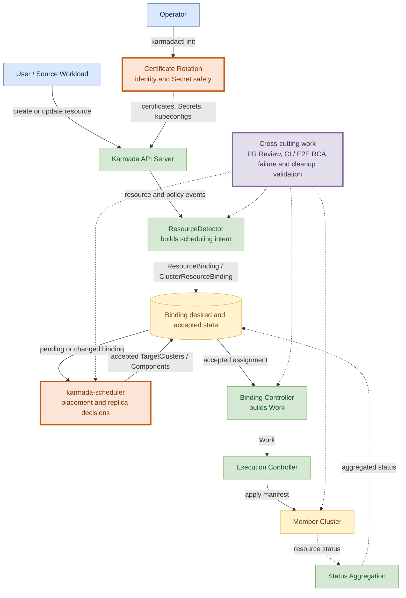

# 华为实习 Karmada 专项：主要工作输出与总结

| 字段 | 内容 |
| --- | --- |
| 项目 | [karmada-io/karmada](https://github.com/karmada-io/karmada) |
| Karmada 独立记录期 | 2026-06-26 至 2026-08-27 |
| 周报范围 | Week 3 至 Week 12；Week 1-2 主线在 AgentCube，不重复复制 |
| 状态口径 | 以 2026-08-27 当周证据为主；后续动态不倒填为当期成果 |

> 统计口径：PR / Issue 数量来自 GitHub authoritative state；代码、测试、Review 和失败过程优先使用本地 topic branches、`intern` 报告与 CI 记录。`已完成` 表示本人当期交付完成，不能替代维护者 review、merge 或正式 API 接受。

## 一、专项总结

Karmada 阶段从一个安装版本同步 PR 开始，逐步进入证书安全、CI / E2E flake、scheduler / WorkloadRebalancer、Binding / Work 状态交付和多组件 workload scheduling。工作方式也从“修一个测试或字段”转为恢复生产调用链：谁产生 desired state、谁写 accepted result、谁更新 Work、失败时哪个状态必须保留。

独立记录期内，在 Karmada 主仓创建 **12 个 PR**，其中 **7 个已 merge、5 个仍 open**；创建 **4 个 Issue**。GitHub `reviewed-by` 可直接定位 8 个他人 PR，另有 scheduler health PR #6863 和 Binding update PR #7810 的公开实质评论，因此采用 **至少 10 个公开实质 PR Review 对象**的保守口径。Karmada 生态还交付并 merge Work API PR #74、drawio-skill PR #94，并完成 Karmada community PR #216 的本地完整性复核。

本地记录包含 **59 个编号 Day 主题、86 份 Day Markdown、10 份 Karmada 周总结**。图示与演示资产包括 **30 个 Mermaid source、34 个 PNG、4 个 draw.io、5 个 SVG 和 2 个 HTML 技术汇报稿**。

## 二、时间与工作分配

### 2.1 分阶段路线

| 阶段 | 周次 | 主要工作 | 结果 |
| --- | --- | --- | --- |
| 项目与证书入口 | Week 3-4 | Karmada 传播链路、安装版本、证书 layout / rotation | #7666 merge；#7690 Issue；#7697 证书轮换 PR 与真实过期恢复实验 |
| CI / E2E 与安全收敛 | Week 5-6 | Ubuntu runner、Flink cleanup、证书 identity、Remedy flake、Feature Proposal / code Review | #7728、#7732 merge；#7776/#7777 提交；#7697 full-diff Review |
| Scheduler 与 detector Review | Week 7-9 | health capacity、deletion protection、affinity reset、waiting store、priority queue、Descheduler | #7777、#7791 merge；#7795 提交；#6863/#7779/#7800/#7810 Review |
| 多组件 scheduling API | Week 10 | #7492 result API、legacy write protection、E2E isolation | #7826 Issue；#7827/#7830/#7833/#7835 提交 |
| Accepted result 与 failure safety | Week 11 | PR stack、result producer、expanded E2E、CI failure classification | #7833 merge；#7841 提交；five-scenario E2E design |
| 职责重构与交付收尾 | Week 12 | trigger/calculation/failure protection 重构、Work API、evidence-first Review | #7830/#7835/#7841 scope 收敛；work-api #74 merge；#7846/#7860 Review |

### 2.2 工作类型分配

以下比例按 Day 主题和主要交付分类折算，不是考勤工时：

| 工作类型 | 估算占比 | 主要内容 |
| --- | ---: | --- |
| Scheduler、Binding 与多组件 scheduling | 35% | WorkloadRebalancer、affinity reset、component result、scale planner、failure-safe Work delivery |
| PR Review 与社区协作 | 20% | code / Feature Proposal / skill PR Review、Issue 评论、维护者方向对齐 |
| CI、E2E 与 flake RCA | 20% | Flink cleanup、Remedy event、fixture isolation、matrix failure classification |
| 证书、CLI 与安全边界 | 15% | `karmadactl init --cert-mode=rotate`、SAN / CA / client-key identity、Secret / kubeconfig |
| 文档、架构图与复用工具 | 10% | Day / Week 报告、Mermaid / draw.io、Descheduler 汇报、review / RCA skills |

## 三、本人工作在 Karmada 系统中的位置

下图回答：本人工作分别落在 Karmada 从 source workload 到 member cluster 的哪一段。

可编辑 canonical source：[final-karmada-internship-system-position.mmd](final-karmada-internship-system-position.mmd)。图中橙色节点是主要代码 / 设计范围，紫色节点表示跨组件 Review 与验证。

### 3.1 主要模块与职责

| 模块 / 路径 | 系统作用 | 本人工作 |
| --- | --- | --- |
| `karmadactl init` / certificates | 初始化 Karmada control plane identity、Secret 和 kubeconfig | 设计并实现 CLI-only leaf rotation；保护 SAN、CA、stable client key、external-etcd credentials 和 Secret metadata |
| `karmada-scheduler` | 选择 cluster、分配 replicas、提交 accepted scheduling result | Review health / affinity / debounce；实现 Full reset regression、component result、scale trigger / calculation / failure protection |
| ResourceDetector | 把 source resource / Policy 变化转换成 Binding intent | Review waiting store identity；分析 component source change 与 E2E residue |
| Binding Controller / Work | 把 accepted Binding assignment 下发到 member cluster | 设计 `TargetCluster.Components`、Work update guard 和 failed reschedule old-Work retention |
| E2E / CI | 验证多集群安装、传播、调度、cleanup 和 regression | Flink CRD cleanup、Remedy event、`karmadactl top` fixture、EstimatorAssumption isolation、CI flake classification |
| Open-source Review | 防止 scope、状态所有权和 failure path 在 merge 前遗漏 | 至少 10 个公开实质 PR Review 对象；形成 production relevance、counterfactual、exact producer 和 concise-first 规则 |

### 3.2 需要掌握的知识与技能

| 能力 | 具体知识 | 实际应用 |
| --- | --- | --- |
| Go / Kubernetes controller | reconcile、event predicate、workqueue、cache、status subresource、context / retry | RemedyActions、ResourceDetector、Binding update、derived cache Review |
| Kubernetes API | CRD、served version、webhook、OpenAPI、resourceVersion、UID、conditions | component result API、v1alpha1 write protection、Job status validation |
| 多集群调度 | Policy、Binding、Work、affinity、replica estimator、Descheduler | #5070/#7662/#7492、#7830/#7835/#7841 |
| PKI / security | CA、SAN、client identity、Secret、kubeconfig、external etcd | `--cert-mode=rotate` 与 no-mutation regressions |
| CI / E2E | kind、matrix、cleanup、flake census、causal timeline、shared runner | #7719/#7776/#7826 和多个 PR CI failure classification |
| Open-source process | DCO、PR scope、Issue / Review、maintainer direction、evidence boundary | 12 authored PR、4 authored Issue、公开 PR Review 与 cross-repo contribution |

## 四、主要工作输出

### 4.1 证书轮换与身份安全

Karmada PR [#7697](https://github.com/karmada-io/karmada/pull/7697) 为 `karmadactl init` 增加 `--cert-mode=rotate`。实现不是简单重新生成证书，而是限定恢复规则：

- 复用已有 CA；
- 从 persisted certificate 保留 SAN；
- 使用 CA + stable client public key 绑定本地 kubeconfig identity；
- external-etcd credentials 只 preserve，不做不安全 replacement；
- Secret 更新保持 update-only 和 metadata；
- 最后一个 Secret 写失败后，重跑能继续收敛。

三节点 host kind 真实实验让 10 分钟 leaf certificates 过期，再 rotate 到 8760h，并通过有序 restart 恢复 control plane、两个 Push member 和 APIService。最终 17 项 checks 通过；PR 截止记录期仍 open，等待维护者审核。

### 4.2 CI / E2E 修复与 Flake 证据

已 merge 的代表工作：

| PR | 输出 | 状态 |
| --- | --- | --- |
| Karmada #7728 | 将 18 个 GitHub Actions workflows 固定到 Ubuntu 24.04 | 已 merge |
| Karmada #7732 | 等待 FlinkDeployment control-plane CRD、member CRD 和 `Cluster.Status.APIEnablements` cleanup | 已 merge，关闭 #7719 |
| Karmada #7777 | 让 `RemedyActions` 状态变化触发 reconcile | 已 merge，关闭 #7776 |
| Karmada #7795 | 使用稳定 Pod fixture 修复 `karmadactl top` E2E 生命周期竞争 | 已 merge |

本地 CI flake census 曾分析 83 个 PR runs，将 23 runs / 29 jobs 归为 flake；报告同时保留一个限制：这是筛选样本，不等于 Karmada 全部 CI failure 的长期统计。

### 4.3 Scheduler / WorkloadRebalancer 与 PR Review

代表性技术判断：

- Karmada PR #6863：health capacity 在 selection 后才置零，会让 primary tier 错误消耗需求并跳过健康 overflow cluster。
- Karmada PR #7779：只 override `Delete` 无法保护 `DeleteCollection`。
- Karmada PR #7800：ResourceDetector waiting store 的 stale identity 可错误匹配同名新对象。
- Karmada PR #7810：`AddAfter` 是 fixed-window delay，不是 trailing-edge debounce，其他 producer 和 leader restart 会改变保证。
- Karmada PR #7662：`PreserveAvailableReplicas` 需要唯一 authoritative state、request / ack 和 Descheduler precedence，不能让 controller / scheduler 双写 Binding。

这些 Review 不只给出结论，还包含 production trigger、call path、counterexample、验证和最小修正方向。

### 4.4 Multi-component scheduling Phase IV

Karmada Issue #7492 的核心例子是 FlinkDeployment：source 从 `JM=1, TM=4` 扩到 `JM=1, TM=6`。最终工作拆为：

| PR | 唯一职责 | 截止 8 月 27 日状态 |
| --- | --- | --- |
| Karmada #7830 | 比较 desired components 与 accepted snapshot，触发 scale rescheduling | open，等待 CI / review |
| Karmada #7833 | scheduler 持久化 per-cluster accepted component result | 已 merge |
| Karmada #7835 | 计算 positive delta；scale-down 跳过 estimator；unsupported fail closed | open，等待 CI / review |
| Karmada #7841 | success 才提交新 accepted result；failure 保留旧 result 和旧 Work | open，等待 CI / review |

配套 Karmada PR #7827 将 EstimatorAssumption E2E 放到 dedicated cluster，避免前一 spec 的 taint / scale residue 污染后一 spec；当前仍 open。

> 注释：`TargetCluster.Components` 只保存 replicas，不保存 requirements provenance。因此 replicas 与 CPU/memory requirements 同时变化仍是明确未覆盖边界，不能写成 Phase IV 已完整 production-ready。

### 4.5 跨项目输出

| 项目 | 输出 | 状态 |
| --- | --- | --- |
| kubernetes-sigs/work-api PR #74 | Kubernetes dependencies 升到 v1.36.4，并同步 Go version documentation | 已 merge |
| Agents365-ai/drawio-skill PR #94 | 修复 canonical version 与 marketplace metadata 漂移，增加 fail-closed consistency test | 已 merge |
| karmada-io/community PR #216 | 复核 Agent Skills routing、grader、pagination 和 output gate | 本地完整 Review；PR 已 merge |
| openai/codex Issue #33051 | 将 stream stall 收敛为首个 request-correlated event 前 watchdog / retry 机制问题 | Issue 已提交；root cause 仍有限定 |

## 五、量化输出

### 5.1 Karmada 主仓贡献

| 类型 | 数量 | 说明 |
| --- | ---: | --- |
| Authored PR | 12 | 7 merge、5 open |
| Authored Issue | 4 | #7690、#7719、#7776、#7826 |
| GitHub `reviewed-by` 可检索的他人 PR | 8 | #7623、#7662、#7692、#7764、#7779、#7800、#7846、#7860 |
| 额外公开实质 Review | 2 | scheduler health #6863、Binding update #7810 |
| 编号 Day 主题 | 59 | Karmada Day 1-59 |
| Day Markdown | 86 | 包含主报告、draft 和已发布评论正文 |
| Karmada 周总结 | 10 | Week 3-12；Week 1-2 在 AgentCube |

### 5.2 Authored PR 状态

| 状态 | PR |
| --- | --- |
| 已 merge | #7666、#7728、#7732、#7777、#7791、#7795、#7833 |
| Open | #7697、#7827、#7830、#7835、#7841 |

## 六、最有成就感的工作

### 6.1 从证书生成推进到身份恢复规则

#7697 的价值不在新增一个 flag，而在把恢复过程中必须保持不变的 CA、SAN、client identity、Secret metadata 和 external-etcd trust boundary 写入实现与测试。真实证书过期实验也暴露了“Secret 更新后进程不会自动热加载”，因此手册必须保留 restart 边界。

### 6.2 把 Flake 从重跑推进到因果修复

#7732 和 #7777 分别切中 cleanup barrier 与 event predicate，均有失败时序和 counterfactual。相反，当多个 etcd 同时出现 `fdatasync` stall 时，没有修改业务代码迎合无关 CI 失败，而是保留 host observability 缺口。

### 6.3 把 #7492 大功能拆成三层可审查职责

最初方案混合 API、interpreter、planner 和 Work rewrite。最终保留 trigger、calculation、failure protection 三个 merge unit，并明确 calculation-only PR 无 production caller、activation 必须与 failure guard 同时出现。这比堆叠更多代码更能降低 Review 风险。

## 七、完成不理想的工作与原因

### 7.1 证书轮换 PR #7697 尚未 merge

实现、17 项 CI 和真实恢复实验已经完成，但 automatic restart、HA runbook、CA / external-etcd rotation 和 Helm/operator parity 不在第一版；维护者审核仍是外部状态。后续应继续保持 CLI-only scope，不为追求 merge 扩大职责。

### 7.2 #7492 尚未完成 live multi-cluster 验证

affected unit/race、E2E compile 和部分 upstream workflows 已通过，但本地没有运行完整 Flink quota/no-fit live E2E。原因是 PR 栈在 8 月 27 日刚完成职责重构，先稳定 merge unit 比在旧 scope 上扩大集群测试更重要。

### 7.3 调研与报告数量较多

86 份 Day Markdown 保留了充分证据，但早期存在同一任务按 draft、CI 和 rebase 分散记录的问题。Karmada 后期规则已改为 task-oriented canonical report，并限制 `PROGRESS.md` 为 80 行 / 8 KiB。

## 八、困难、对策与解决方法

| 困难 | 现象 | 对策 | 结果 |
| --- | --- | --- | --- |
| 多 writer 状态冲突 | controller、scheduler、Policy 都可能改 Binding | 先定义 authoritative state、request、accepted result 和 Work commit gate | #7492 路线收敛为 desired -> accepted -> delivered 三层 |
| E2E failure 误归因 | 最终失败 spec 不一定是 producer | 建立五 lane timed causality：producer、cleanup、shared state、consumer、assertion | #7826 / #7827 使用 dedicated cluster 修复污染 |
| API version compatibility | 旧 served version status write 丢新字段 | 真实 API Server round-trip 与 legacy protection | #7830 设计包含旧版本写入保护边界 |
| Review comment 难懂 | 技术正确但依赖本地上下文 | `observation -> counterexample -> reasoning -> action`，必要时 Mermaid | 后续评论可脱离报告阅读 |
| CI shared infrastructure | etcd stall、registry failure、Docker cleanup | 找 common signal，不按失败测试名称改产品 | 避免 timeout / retry 掩盖 root cause |
| Scope 持续扩张 | 一个 PR 同时承担 API、planner、delivery、E2E | 每个 PR 写唯一职责、non-goal 和 residual diff | #7830/#7835/#7841 最终可独立答辩 |

## 九、完成任务过程中的收获

1. **状态所有权优先于状态机。** 没有唯一 writer 和 accepted state 时，重试和 timer 只能改变概率，不能提供一致性保证。
2. **测试必须经过真实 producer。** 手工构造对象可能绕过 webhook、API validation、controller 默认值和 lifecycle event。
3. **CI 通过要绑定 exact behavior。** package compile、filtered test、workflow name 和 live E2E 是不同证据层。
4. **Review 的产出是决策，不是评论数量。** 一个 source-backed counterexample 比多个泛化建议更能推动作者修改。
5. **Open-source 完成状态要分层。** 本人可以完成提交、Review 和验证；maintainer approval、merge 和 release timing 仍由社区负责。

## 十、答辩建议（10 分钟）

| 时间 | 内容 | 重点 |
| ---: | --- | --- |
| 1 分钟 | Karmada 系统位置 | Source -> Binding -> Scheduler -> Work -> Member Cluster，以及证书入口 |
| 2 分钟 | 证书轮换 #7697 | 为什么恢复规则比重新生成证书更重要 |
| 2 分钟 | CI / E2E | #7732、#7777、#7795 如何从 flake 变成 causal fix |
| 3 分钟 | Multi-component scheduling | desired / accepted / delivered 三层与 #7830/#7835/#7841 分工 |
| 1 分钟 | PR Review | health、DeleteCollection、waiting store、debounce 四个典型 finding |
| 1 分钟 | 输出与不足 | 12 PR / 7 merge / 5 open、live E2E 边界和后续方向 |

## 十一、证据索引

- [Week 3：进入 Karmada](week3-summary.md)
- [Week 4：证书轮换](week4-summary.md)
- [Week 5：CI / Flake](week5-summary.md)
- [Week 6：证书、Review 与 Remedy](week6-summary.md)
- [Week 7：Scheduler Review 与回归提交](week7-summary.md)
- [Week 8：Waiting Store、Queue 与 Descheduler](week8-summary.md)
- [Week 9：Descheduler 与 Binding Update Review](week9-summary.md)
- [Week 10：#7492 API 与 E2E causality](week10-summary.md)
- [Week 11：Accepted result 与 failure safety](week11-summary.md)
- [Week 12：Phase IV 重构与收尾](week12-summary.md)
- [Day 59：#7492 Phase IV closeout](day59-issue7492-phase-iv-pr-refactor-closeout.md)

> 最终结论：Karmada 阶段完成了从安装 / 证书入口、CI / E2E 修复，到 scheduler / Binding / Work 多组件状态交付的完整训练。最重要的可复用能力是把 desired、accepted 和 delivered state 分开，并用真实 producer、failure path 和 exact test evidence 判断一个改动是否适合进入社区主线。
