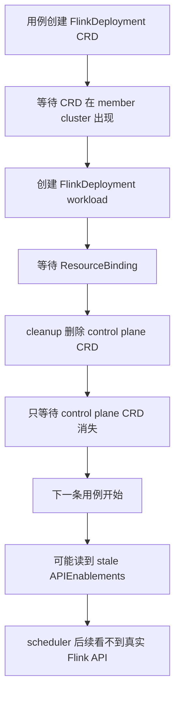
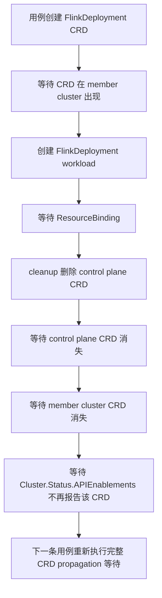

# #7719 FlinkDeployment e2e flake 修复 PR 设计

日期：2026-07-09

## 背景

Issue：<https://github.com/karmada-io/karmada/issues/7719>

现象：多个 FlinkDeployment 相关 e2e 用例会创建并删除同一个 CRD `flinkdeployments.flink.apache.org`。旧 cleanup 只等待 control plane CRD 删除完成，但 member cluster 上的 CRD 删除和 Karmada `Cluster.Status.APIEnablements` 收敛是异步的。后续用例如果基于 stale APIEnablements 判断 CRD 已可用，可能继续创建 FlinkDeployment workload，最终 scheduler 侧看不到真实 API，等待 ResourceBinding 超时。

已有证据：

- #7697 的 PR CI 命中 `EstimatorAssumption ResourceQuota` FlinkDeployment ResourceBinding timeout，空提交 trigger 后全绿。
- #7728 合并后 master push CI 命中 `EstimatorAssumption NodeResource` FlinkDeployment ResourceBinding timeout。
- 本地 diagnostic 曾观察到 control plane CRD 已消失后，member CRD / APIEnablements 仍短时间保留。
- 候选分支 `test/estimator-flink-crd-flake` commit `f2e7c434b` 已通过 fork push CI。

## 文件级 scope

| 文件 | 动作 | 原因 |
| --- | --- | --- |
| `test/e2e/framework/customresourcedefine.go` | 新增 e2e helper | 等待指定 CRD 从 member cluster 的 `Cluster.Status.APIEnablements` 中消失 |
| `test/e2e/suites/base/estimator_test.go` | 修改 FlinkDeployment CRD cleanup | estimator assumption 两个 FlinkDeployment 用例都需要等待 member CRD 和 APIEnablements 收敛 |
| `test/e2e/suites/base/federatedresourcequota_test.go` | 修改 FlinkDeployment CRD cleanup | 同样创建 / 删除 FlinkDeployment CRD，避免给后续用例留下 stale APIEnablements |
| `test/e2e/suites/base/schedule_multi_template_test.go` | 修改 FlinkDeployment CRD cleanup | 同样创建 / 删除 FlinkDeployment CRD，保持 cleanup 边界一致 |

## 不修改范围

- 不改 scheduler / estimator 生产逻辑。
- 不改 FlinkDeployment resource interpreter。
- 不改 CRD propagation controller。
- 不新增 e2e spec，只收紧现有 cleanup 等待边界。
- 不把本地报告、统计台账、中文复盘放进 upstream PR 分支。

## 当前流程



## 目标流程



## 函数设计

新增 helper：

```go
func WaitCRDDisappearedFromClusterStatus(client karmada.Interface, clusters []string, crdAPIVersion, crdKind string)
```

实现要点：

- 使用 `schema.FromAPIVersionAndKind(crdAPIVersion, crdKind)` 构造 GVK。
- 对每个目标 cluster 轮询 `FetchCluster()`。
- 等待 `cluster.APIEnablement(gvk) != clusterv1alpha1.APIEnabled`。
- 使用现有 e2e `PollTimeout` / `PollInterval`，保持与其他 framework helper 风格一致。

## 验证计划

- `git diff --check`
- `go test ./test/e2e/framework ./test/e2e/suites/base -run '^$' -count=0`
- push fork 分支触发 CI，至少确认 `CI Workflow` 和 e2e matrix 开始运行；完整结果再补 PR body。

## PR 说明重点

- 这是 e2e flake cleanup fix，不是功能变更。
- PR 应写 `Fixes #7719`。
- `Special notes` 里注明只影响测试代码，并引用 #7697 / #7728 的 flake 证据已记录在 issue 中。
- 按项目习惯披露 AI assistance：用于日志分析、diff 对比和 PR 文案整理，代码由提交者审阅验证。

## Fork CI 第一次失败分析

分支：`ranxi2001:test/flinkdeployment-crd-cleanup`

提交：`1240559dd34cc0eedd0ec6cffe97b5c0076660dc`

Run：<https://github.com/ranxi2001/karmada/actions/runs/29006012630>

第一次 attempt 结果：

- Chart / CLI / Operator workflow 均通过。
- CI Workflow 中 lint / codegen / compile / unit test 通过。
- CI Workflow 中 e2e v1.35.0 / v1.36.1 通过。
- 只有 e2e v1.34.0 失败，失败 job 为 `86080188511`。

失败时间线：

- `09:26:12-09:26:19`：artifact 中 `containerd.log` 显示多个控制面容器退出，包括 `karmada-scheduler`、`karmada-kube-controller-manager`、`karmada-descheduler`、`karmada-controller-manager`、host `kube-controller-manager` 和 host `kube-scheduler`。
- `09:26:13`：`karmada-controller-manager` 日志显示大量 controller / reflector shutdown，最终 `command failed` 为 `leader election lost`。
- `09:26:51`：最早的 Ginkgo 硬失败出现在 `[Suspension] ClusterPropagationPolicy testing [It] suspend the CPP dispatching`，`UpdateClusterPropagationPolicyWithSpec` 返回 `etcdserver: request timed out`，位置是 `test/e2e/framework/clusterpropagationpolicy.go:75`。
- 之后多个 cleanup / AfterSuite 开始出现 `https://172.18.0.5:5443` 或 member apiserver `connection refused`。
- `09:33:21`：`[ScheduleMultiTemplate] FlinkDeployment scheduling` 在新增的 member CRD disappearance wait 中超时，位置是 `test/e2e/framework/customresourcedefine.go:116`；这发生在控制面已经失稳之后。

当前判断：这次失败更像 v1.34 e2e 环境整体失稳，不是 #7719 修复代码的确定性失败。已触发失败 job 重跑，run attempt 2 中新的 `e2e test (v1.34.0)` job `86098566248` 已通过；最终 fork push CI 为 `2 skipped, 4 success`。
